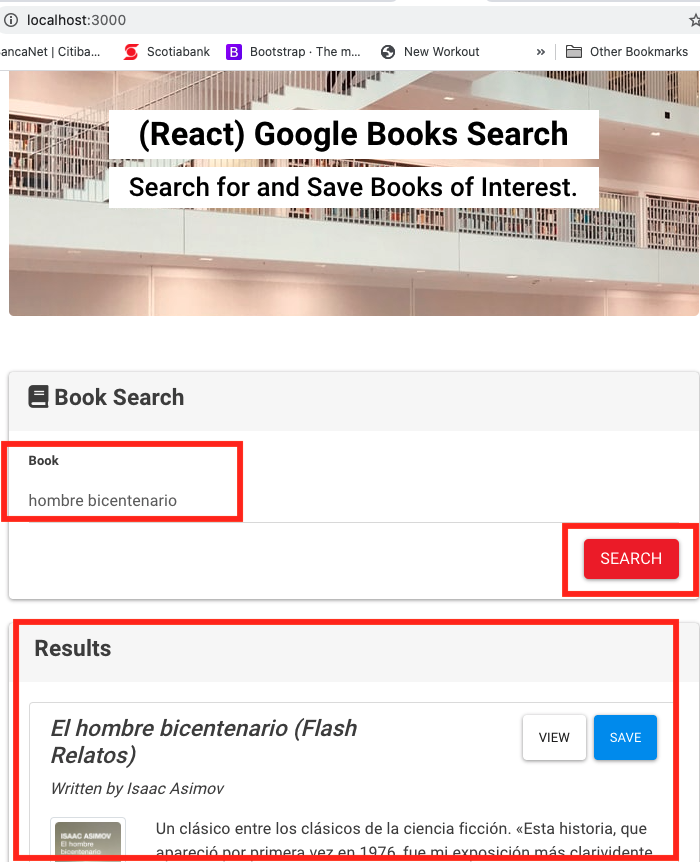
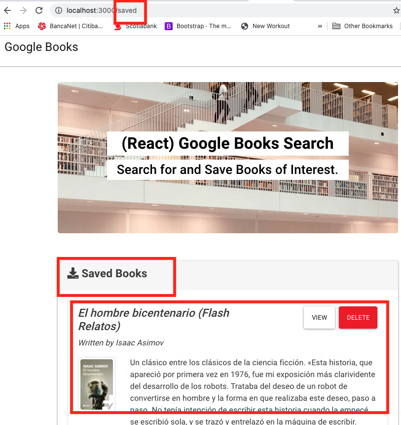
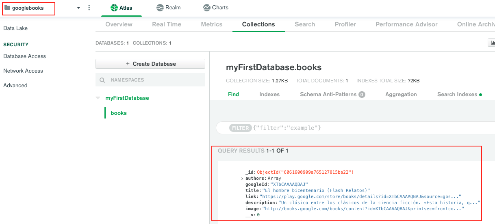

# Google Books Search

## Preview

### Book Search preview:

### Saved Book preview:

### MongoDB Collection - googlebooks:

### Overview

In this activity, you'll create a new React-based Google Books Search app. This assignment requires you to create React components, work with helper/util functions, and utilize React lifecycle methods to query and display books based on user searches. You'll also use Node, Express and MongoDB so that users can save books to review or purchase later.

* This application requires at minimum 2 pages, check out the following mockup images for each page:

  * [Search](Search.png) - User can search for books via the Google Books API and render them here. User has the option to "View" a book, bringing them to the book on Google Books, or "Save" a book, saving it to the Mongo database.

  * [Saved](Saved.png) - Renders all books saved to the Mongo database. User has an option to "View" the book, bringing them to the book on Google Books, or "Delete" a book, removing it from the Mongo database.

  * [Socket.io NPM package](https://www.npmjs.com/package/socket.io)

Deployed app to HEROKU:

* [Deployed app to Heroku](https://pure-river-31775.herokuapp.com)

- - -

